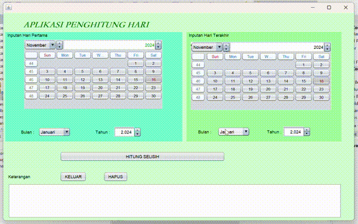

# AplikasiSelisihHari
 Siti Aisyah Nor Fitriani - 2210010043 - Tugas 4

## Deskripsi Aplikasi
Aplikasi ini adalah aplikasi desktop sederhana yang dirancang untuk menghitung selisih hari antara dua tanggal. Aplikasi ini menggunakan komponen `JCalendar` untuk memudahkan pengguna dalam memilih tanggal. Dengan antarmuka yang user-friendly, aplikasi ini memudahkan pengguna untuk menghitung durasi waktu antara dua tanggal untuk berbagai keperluan, seperti menghitung jumlah hari antara dua peristiwa penting.

## Fitur Utama
- **Menghitung Selisih Hari**: Hitung jumlah hari antara dua tanggal yang dipilih pengguna.
- **Validasi Tahun 4 Digit**: Memastikan tahun yang dimasukkan berformat 4 digit untuk menghindari kesalahan input.
- **Pemilihan Tanggal Awal dan Akhir**: Pilih tanggal awal dan akhir menggunakan `JCalendar`.
- **Deteksi Tahun Kabisat**: Memberikan informasi apakah tahun yang dipilih adalah tahun kabisat.
- **Nama Hari dalam Bahasa Indonesia**: Menampilkan nama hari dalam bahasa Indonesia untuk tanggal awal dan akhir.
- **Tombol Reset**: Menghapus semua input pengguna untuk mereset aplikasi.
- **Tombol Keluar**: Menyediakan dialog konfirmasi untuk keluar dari aplikasi.

## Cara Menggunakan Aplikasi
1. **Pilih Tanggal Awal**:
   - Gunakan `JCalendar` di sisi kiri untuk memilih tanggal awal.
   - Pilih bulan dan tahun menggunakan dropdown dan spinner di samping `JCalendar` pertama.

2. **Pilih Tanggal Akhir**:
   - Gunakan `JCalendar` di sisi kanan untuk memilih tanggal akhir.
   - Pilih bulan dan tahun yang diinginkan.

3. **Hitung Selisih Hari**:
   - Klik tombol **"HITUNG SELISIH"** untuk menghitung jumlah hari antara dua tanggal yang dipilih.
   - Hasil akan ditampilkan di area teks, termasuk informasi tambahan seperti apakah tahun awal kabisat dan nama hari pada tanggal awal dan akhir.

4. **Hapus Input**:
   - Klik tombol **"HAPUS"** untuk menghapus semua data input dan hasil yang telah ditampilkan.

5. **Keluar dari Aplikasi**:
   - Klik tombol **"KELUAR"** untuk menutup aplikasi. Sebuah dialog konfirmasi akan muncul untuk memastikan apakah pengguna ingin keluar dari aplikasi.

## Pembuat Aplikasi
**Siti Aisyah Nor Fitriani**
**2210010043**

## Demo

## Catatan
- Aplikasi ini hanya menghitung jumlah hari secara tepat antara dua tanggal, tanpa memperhitungkan waktu atau zona waktu.

